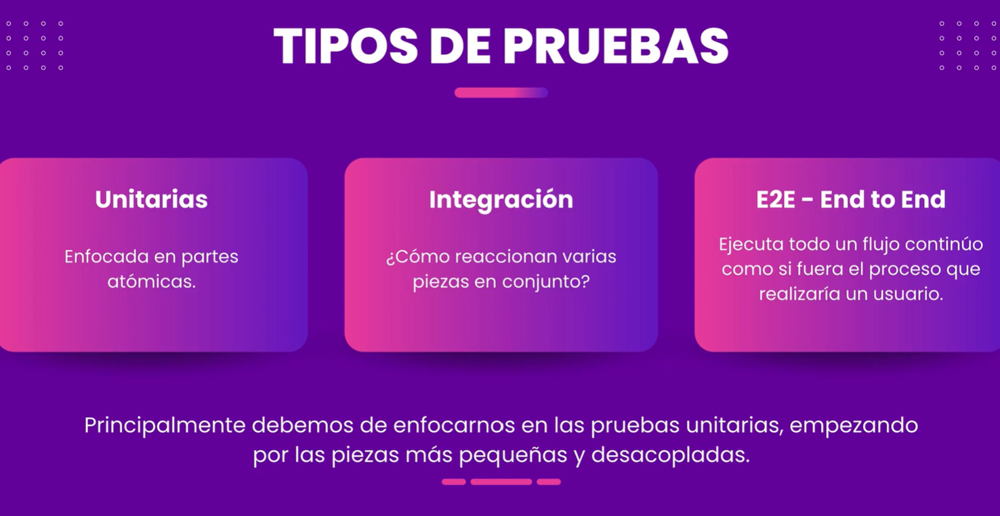

# NestJS + Testing: Pruebas unitarias y end to end (e2e)

### Introducción

Características de las pruebas:

- Fáciles de escribir y leer
- Rápidas
- Flexibles



**Unitarias**

- Pruebas atómicas simples
- Se recomienda no tener dependencias de otros componentes
- Deben ser especializadas en la pieza que estamos probando

**Integración**

- Probar como funcionan los elementos en conjunto
- No deben ser mayores a las unitarias

**E2E**

- Un flujo aislado
- Objetivo específico
- Pruebas de casos improbables

### Coverage (Cobertura)

Porcentaje que indica cuanto código a sido probado, hay coverage de líneas de código, ramas de decisión, funciones/métodos probados y de condiciones.

### Estándar AAA

**Arrange (Preparar)**

- Se configura el entorno de prueba
- Se crean objetos, se inicializan variables y se simulan dependencias (mocks o stubs)
- Ejemplo: crear una instancia de la clase que vas a testear.

**Act (Actuar)**

- Se ejecuta la acción que se quiere probar
- Normalmente es una llamada a un método o función
- Ejemplo: llamar a mi clase `calcularResultado()`

**Assert (Afirmar)**

- Se verifica que el resultado sea el esperado
- Se usan afirmaciones como assertEquals, expect, etc.
- Ejemplo: comprobar que el resultado sea 42

```typescript
test('suma dos números correctamente', () => {
  // Arrange
  const calculadora = new Calculadora()

  // Act
  const resultado = calculadora.sumar(2, 3)

  // Assert
  expect(resultado).toBe(5)
})
```

## Herramientas

- `spyOn`: es un interceptor de las llamadas a un método, o sea, verifica si fue llamado y cuántas veces.
  - `mockImplementation`: simular una implementación del método _sin ser llamado_.

**_Créditos_**

👉 [https://cursos.devtalles.com/courses/NestJS-Testing](https://cursos.devtalles.com/courses/NestJS-Testing)
